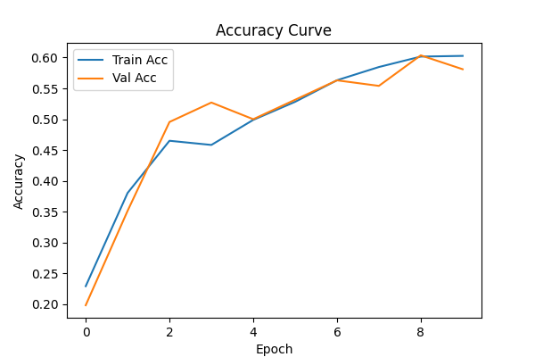
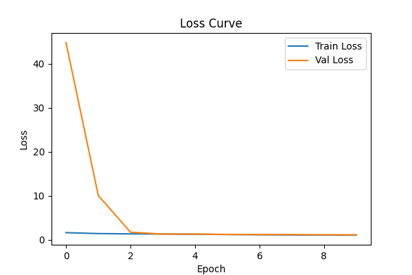
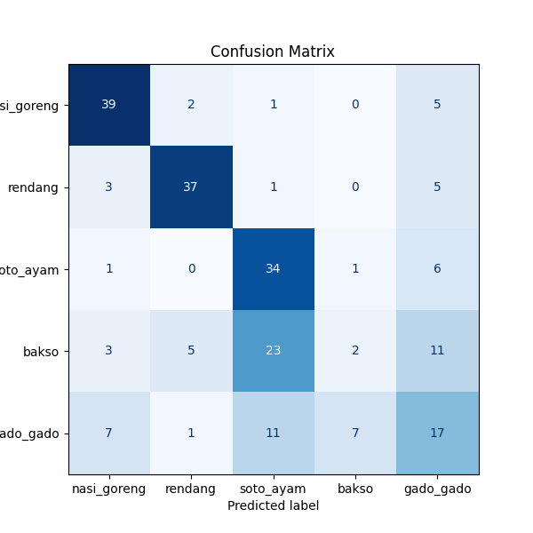
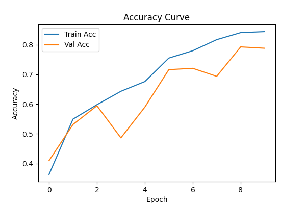
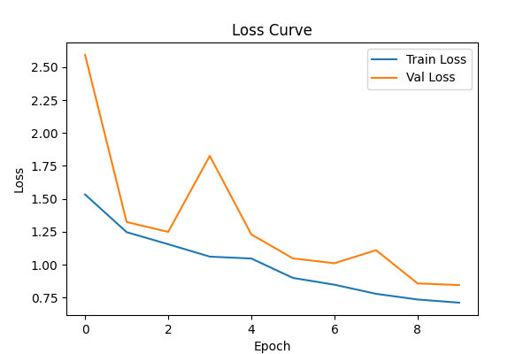
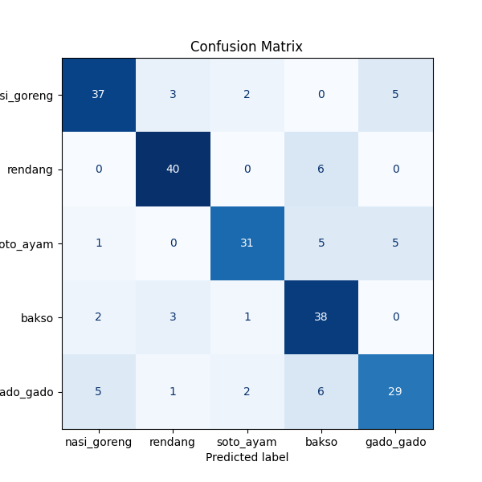

# **Deep Learning Resnet Explore (Tim ZAR)**

Anggota : 
- Zefanya Danovanta Tarigan (122140101)
- Ihya Razky Hidayat (122140167)
- Abraham Ganda Napitu (122140095)

## Hyperparameter 
- Learning Rate = 1e-3
- Batch Size = 32
- Epochs = 10
- Workers = 0
- Seed = 42
- Optimizer = AdamW
- Weight Decay = 1e-4
- Validation Ratio = 0.2
- Image Size = 224 x 224

## **Analisis PLAIN-34 vs ResNet-34**

## **Tahap 1 - Analisis Performa Model Dasar (Plain Network)**
**Analisis :**
- Awal training lambat, val acc hanya ~20% di epoch 1.
- Ada kenaikan hingga sekitar 50% pada epoch 3–4.
- Akhir training stuck di 58% val acc, menunjukkan underfitting pada model.

### **Plot History**

## **Tahap 2 - Implementasi Residual Connection (Menjadi ResNet-34)**
**Analisis :**
- Sejak awal sudah lebih tinggi (val acc ~41% di epoch 1).
- Progres cepat dan konsisten.
- Akhir training stabil di ~79% val acc, dengan train acc ~84%.
- Residual connection terbukti membantu mengatasi masalah degradasi dan mempercepat konvergensi.

### **Plot History**

## Tabel Perbandingan 
| Model | Train Acc (%) |Val Acc (%)|Selisih Train & Val|
| ------------- |:-------------:|:-------------:|:-------------:|
| Plain-34     | 60.27  |58.11|+2.16|
| ResNet-34      | 84.42 | 78.83|+5.59 |

## Hasil 
1. Apakah residual connection berhasil mengatasi masalah degradasi?
    - **Jawaban :** residual connection berhasil mengatasi masalah degradasi. Val accuracy naik 20.7% dari 58.11% → 78.83% (Plain-34 → ResNet-34) pada 10 epoch yang sama.

2. Seberapa signifikan peningkatannya?
    - **Jawaban :** meningkatkan akurasi validasi sekitar 20% dan membuat pelatihan jauh lebih cepat dan efektif.
  
## **Rekomendasi Lanjutan**
1. Perpanjang  epoch hingga 30–50 untuk melihat apakah Plain-34 mengejar; pantau train/val loss untuk tanda under/overfitting.
2. Hyperparameter sweep: lr, weight decay, batch size, augmentation (mixup, RandAugment) — kedua arsitektur diberi treatment sama.   
    

